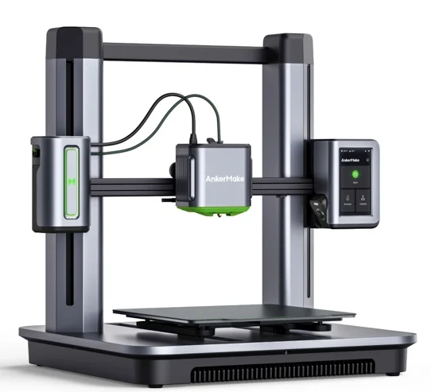
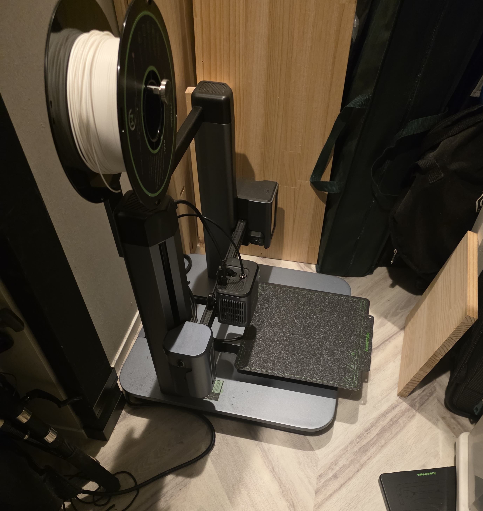
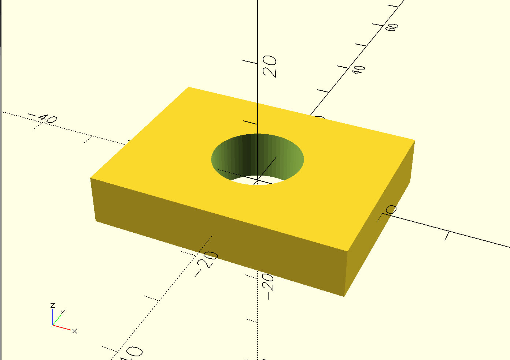
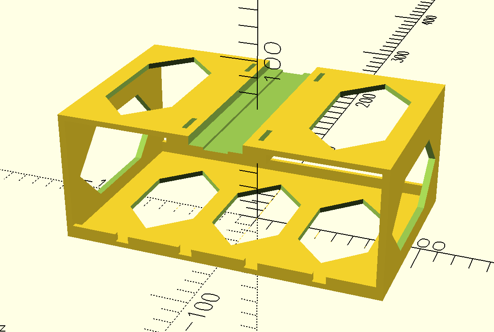
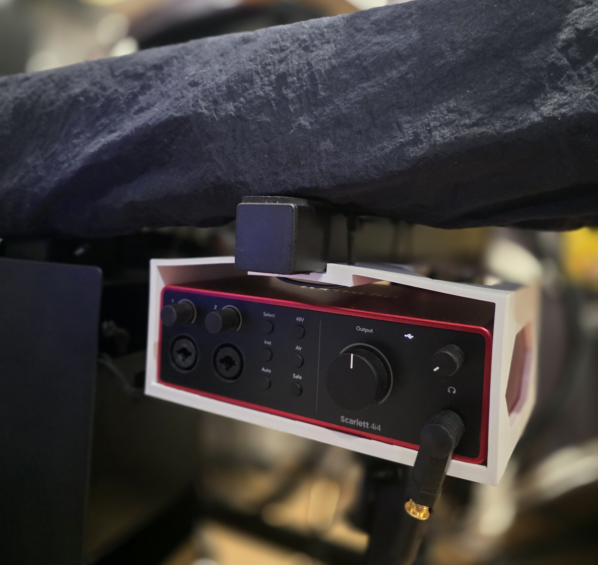
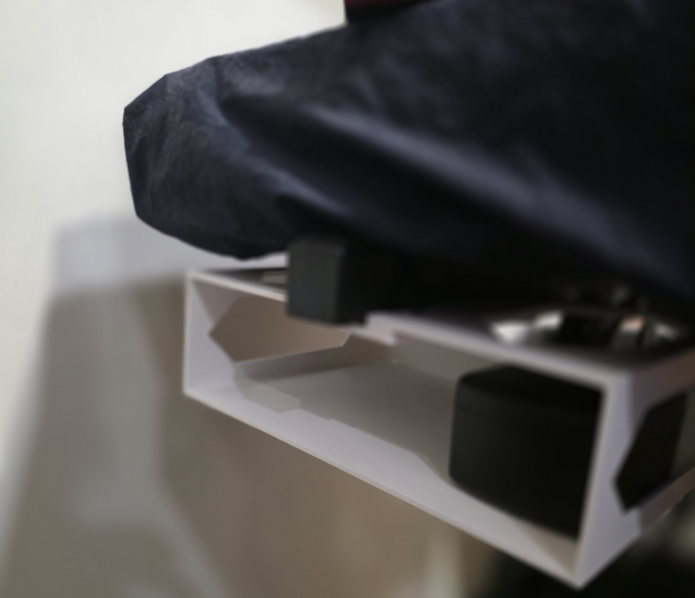
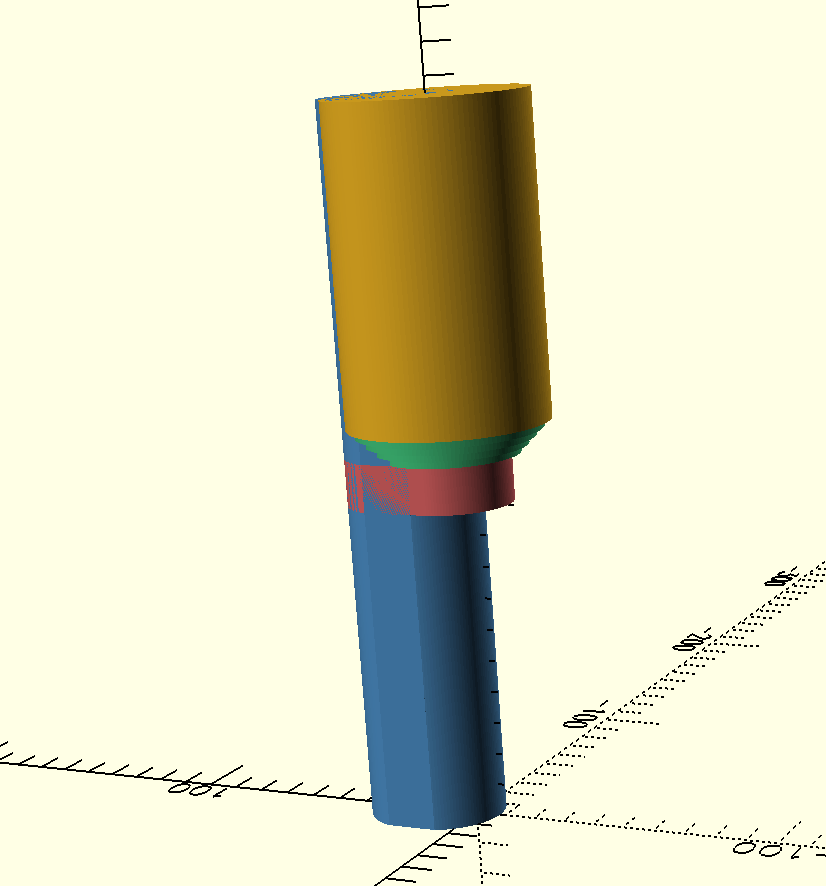
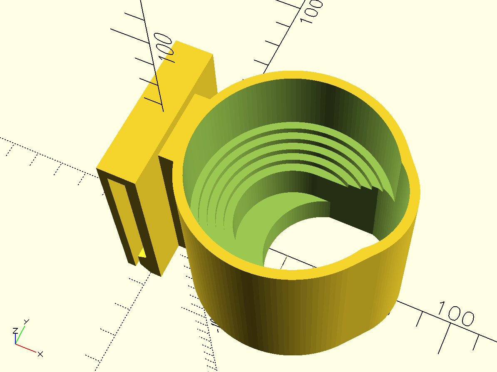
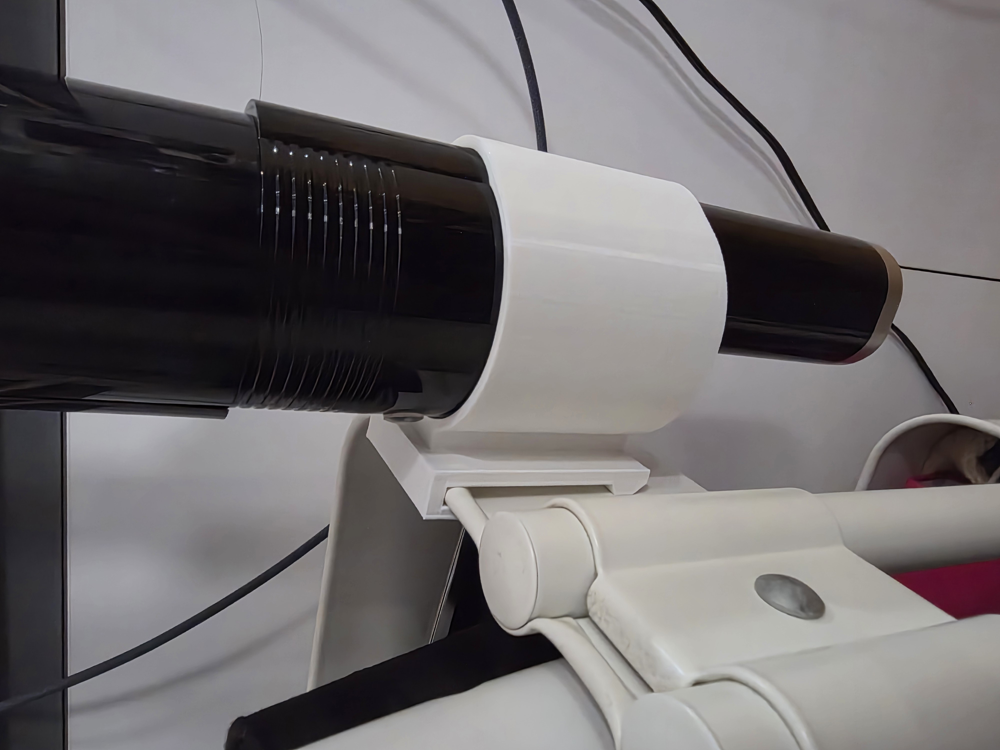
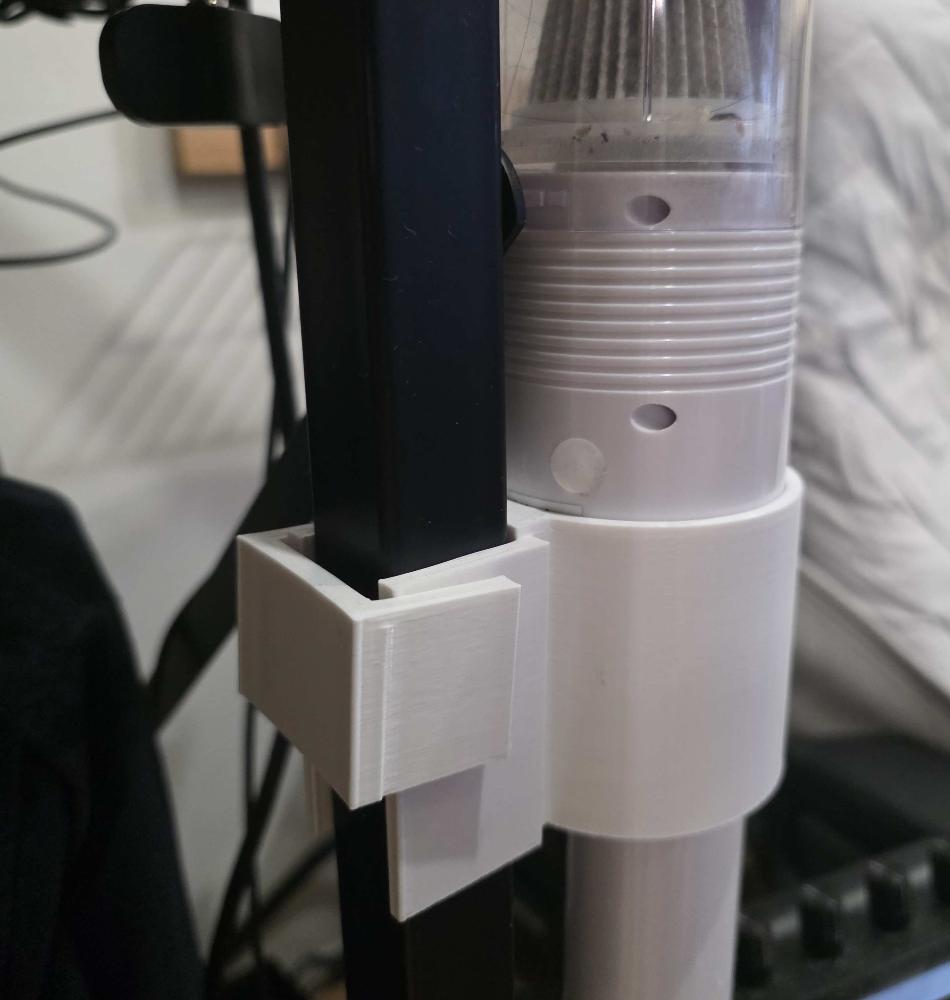

3Dプリンターは結構前に購入したが、あまり活用できていなかった。自作キーボードのモデルなどを印刷することはあっても、自分でデザインを一から起こして作る機会は少なかった。モデルを作るのが面倒だったからだ。

{width=480}

<p class="image-caption">Anker M5。あまり使わないうちに3Dプリンター事業ごと撤退してしまった。</p>

{width=480}

<p class="image-caption">自宅での様子。いい感じの置き場所がなくて物置の床に直置きしている。</p>

3Dプリンターの代表的な用途の一つが身の回りをちょっと便利にするような自分専用の小物を作るというものだ。100均かホームセンターに行けば大体のものが揃う中で、3Dプリンターがあれば、そんなんほしいやつ他におらんやろ、というものをジャストフィットで作れてしまう。

3Dプリンターで物を作るには当然ながらまずはモデルを作る必要がある。モデルの作り方は、大きく二つに分けられる。幾何学図形を組み合わせるソリッドモデリングと、粘土をこねるように変形させるスカルプティングである。

便利小物のようなものは大抵前者で、FreeCADのようなCADを使ってモデルをデザインする。モデルが完成したらSTLや3MFなどの形式で書き出し、スライサーを通してGコードにしてから3Dプリンターに投げれば、数時間後には印刷された実物が手に入る。ちょっと前はPC上でお絵描きしていたものが使えるものとして手に入る。すごい時代だ。

ただ、CADで欲しいものをデザインするのは難しい。素人は頭になんとなくこんなやつが欲しいなと思っていてもそれを具体的な形状に落とすことができない。そもそも絵心がないので頭の中のぼんやりした形をモデルに落とし込むことができないのだ。

## OpenSCADとAIエージェント

CADのソフトウェアの中には[OpenSCAD](https://openscad.org/)のように幾何学図形の組み合わせをコードとして記述できるものがある。これはなかなか便利で、GUIのCADを前にして途方にくれていた頃よりは遥かにモデルの作成の進め方を理解しやすかった。

```openscad
$fn = 64;

difference() {
    cube([40, 30, 8], center = true);
    cylinder(h = 12, d = 14, center = true);
}
```

{width=480}

<p class="image-caption">直方体を円柱でくり抜いているモデル。</p>

とはいえ、じゃあどういうモデルがあれば自分が欲しいものができるか、という肝心の問題は当然OpenSCADを使っても解決しない。

そんな感じであまり3Dプリンターを有効に活用できない日々が続いていた。AIエージェントにコードを書かせているうちに、OpenSCADも書かせれば、欲しいものを伝えるだけで望んだモデルが作れるのではないかと思いついた。実際に試すと、期待していた以上の結果が得られた。

## オーディオインターフェースをキーボードスタンドの下にマウント

Scarlett 4i4というオーディオインターフェースを使っている。少し前にデスク環境を大幅に更新して、デスク自体を捨て去ってしまったため、オーディオインターフェースの置き場に困っていた。

チェアの隣には88鍵のキーボードをスタンドに載せてある。スタンドの下は、足を出し入れする部分以外が大きなデッドスペースになっている。ここにオーディオインターフェースを置く案は以前からあった。ただし、足との干渉を避けるには、スタンドから吊るす必要がある。そんなニッチな製品は当然存在しないため、計画は頓挫していた。

AIに伝えたところこんな感じのモデルを作ってくれた。ざっくり作ってくれた後に、指示された通りにノギスでサイズを測った結果を伝えて、微調整してくれた。

{width=480}

<p class="image-caption">オーディオインターフェースマウントのモデル。くり抜きが六角形になっているのはオーバーハング角を緩やかにするため。</p>

真ん中の溝にスタンドのアームをはめて両脇の穴に通した結束バンドで固定する想定である。溝が二段になっているのは、アームの下側に少しだけねじ山が出っ張っていることを伝えたところ、それを避けるために彫ってくれた。細やかな心配りだ。

実際に設置した様子はこちら。天板が薄くて少し撓んでしまっていることを除けば完璧なフィットである。

{width=640}
<p class="image-caption">オーディオインターフェースを設置した様子。シンデレラフィットしている。</p>

また、反対側のアームもスペースが余っているため、特に置くものは決まっていないが、同じ固定部を流用してトレーを作ってもらった。形状をモジュール化して使い回しやすい点はOpenSCADを用いる利点の一つだ。

{width=640}
<p class="image-caption">同じマウント方式で作ったトレー。とりあえずギター用のワイヤレスを入れている。</p>

## ハンディ掃除機を引っ掛けて設置するホルダー

デスク周りのちょっとした清掃のためにMyStick Neoというハンディ掃除機を使用している。大きさの割に十分な吸引力がありおすすめできるハンディ掃除機である。ただ、一つ欠点があり、コンパクトで場所を取らないというメリットがある一方で、独特な形状からか自立しないのだ。何かに立てかけるか横たえて置いておくしかない。

コンパクトさからそこまで邪魔にならないため、とりあえず適当な場所に置いていたが、本当はせっかくのコンパクトさを活かすためにもさっと取り出せるところに引っ掛けておけるのがいいなと思っていた。

こちらも当然ぴったりのものは存在しないので、AIエージェントに伝えて3Dモデルを作ってもらった。ただ、こちらのモデルは最初からホルダーを作るように伝えてもなかなか思ったとおりのものができなかった。掃除機の形状が独特なため、それをちゃんと共有することができなかったのだ。そのため、一度大きく方針を転換し、先に掃除機の形状を表すリファレンスモデルを作ってもらった。

{width=480}

<p class="image-caption">MyStick Neoのリファレンスモデル。背面の微妙な盛り上がりも表現できている。</p>

このリファレンスモデルをもとに、掃除機を保持するための方法とデザインを決めてモデルを作ってもらった。

{width=480}

<p class="image-caption">掃除機ホルダーのモデル。持ち手を穴に通し、段差で保持する形状。</p>

この方針転換はとても効果的で、リファレンスモデルを基準に、細部の形状や掃除機の保持方法を具体的に相談できるようになった。

完成品はこちら。IKEAのワゴンの壁に引っ掛けている。

{width=640}

<p class="image-caption">掃除機ホルダー。IKEAのワゴンの壁に引っ掛けている。</p>

また、掃除機を二台持っていたため、そちらを設置するために固定方式を変えたモデルをもう一つ作ってもらった。

{width=640}

<p class="image-caption">棚の脚に横からはめて上からキーをかぶせて固定する感じになっている。3Dプリンターの精度がよくなく固定力がちょっと足りないため改善する予定。</p>

## AIと物理世界が繋がった

AIエージェントに欲しいものを伝えると、3Dモデルを作ってくれて、それを3Dプリンターで印刷すれば生活がちょっと便利になる。AIが画面の中だけで完結せずに物理世界に繋がるのは、今までにない新鮮な体験だった。

半導体はとてつもない勢いで毎日値上がりしているが、3Dプリンターは十分な性能のものが今や数万円で手に入る。DGX Sparkの代わりに数十分の一の価格で手に入る3Dプリンターを買って遊んでみるのもいいかもしれない。
